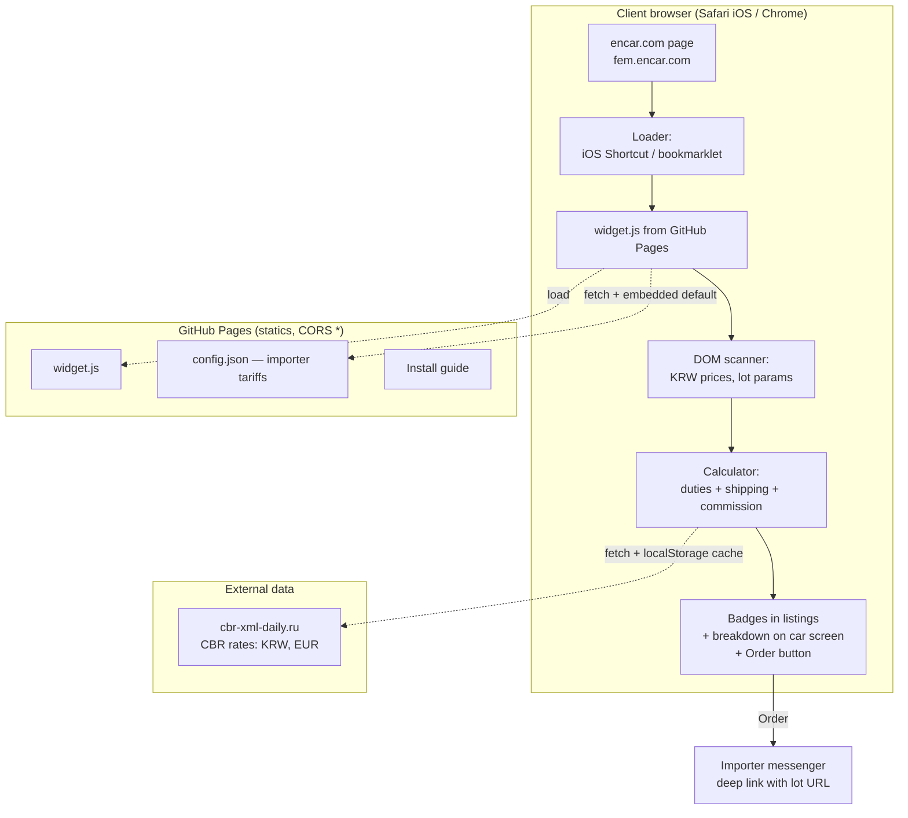

# Encar RU Overlay - Plan

## Goal Capsule

- **Objective:** clients of a car importer browse encar.com in their own browser (with built-in page translation) and see an all-in RUB price next to every KRW price; on the car detail screen the badge expands into a full cost breakdown. Everything runs on top of the site — no scraping, no backend.
- **Product authority:** the customer (car importer, represented by the user). Architect — Claude; implementation via workflow orchestration of subagents with architect acceptance.
- **Stop conditions:** after U1–U4 (mock version on listing + car screen, deployed to GitHub Pages) — mandatory stop for customer review; do not start U5–U8 until approved. Blocker: if the encar DOM does not expose data needed to annotate prices — stop and report.
- **Product Contract preservation:** R9 changed — was "our API computes", now "client-side computation" (customer's decision to drop the backend). All other R/A/F/AE unchanged.

---

## Product Contract

### Summary

Overlay kit for encar.com: a script delivered via iOS Shortcut (Safari/iPhone) and bookmarklet (Chrome) injects RUB prices into the DOM of the open page — in search listings and on the car screen — and expands into a cost breakdown. Computation runs in the script itself using CBR (Central Bank of Russia) rates; page translation is the browser's; all statics are hosted on GitHub Pages.

### Problem Frame

The importer's clients pick cars on encar.com but understand neither Korean nor KRW prices. Today they bring a lot to the importer, who manually computes the all-in Russian price (duties, shipping, commission). This creates a constant stream of manual calculations and prevents clients from comparing options on their own. Competitors already run russified encar catalogs — a convenience-seeking client risks walking into someone else's funnel.

### Key Decisions

- **Overlay in the client's browser, not a mirror or own catalog.** The encar page is already legally open in the client's browser; the script only draws on top (like price-comparison extensions). Zero scraping, zero data costs, legally clean. Own catalog on purchased encar data (Auto-API, Carapis) is the deliberate v2 fallback if install friction filters out clients.
- **Translation is the browser's built-in.** Chrome, Yandex Browser and Safari translate pages natively; we build no translation.
- **Delivery without extension stores:** iOS Shortcut (installed from a link in 1–2 taps) and a Chrome bookmarklet.
- **Lot data comes only from the open page's DOM.** No requests to encar servers.
- **Honest precision:** listing prices may be approximate (not all inputs visible), car-screen computation is exact.

### Actors

- A1. Client — car buyer; installs the overlay from the guide, browses encar, sends an order request.
- A2. Importer (customer) — sends clients the guide link, receives requests in messenger, edits commission/tariffs in config.
- A3. Overlay script — injects prices, computes client-side from config and CBR rates.

### Requirements

**Widget and DOM injection**

- R1. After activation the script finds KRW prices on the encar page and draws an all-in RUB price next to each: per car in search listings and on the car detail screen.
- R2. On the car screen the badge expands on tap into a breakdown: lot price, cost items (duties, shipping, commission, etc.), RUB total.
- R3. When inputs for exact computation are missing (typical in listings), the price shows an approximation marker; the car screen computes exactly.
- R4. The widget survives dynamic content: prices appearing after scroll or in-site navigation get annotated without re-activation.
- R5. The car screen has an "Order this car" button: opens the importer's messenger with a prefilled message containing the lot URL.

**Delivery and install**

- R6. iPhone/Safari: install via iOS Shortcut from a link; run via Share → "Price in RF" on any encar page.
- R7. Chrome (desktop and Android): bookmarklet with the same functionality.
- R8. Russian-language guide page: install steps for both methods, browser-translation how-to; the importer sends its link to clients.

**Computation**

- R9. Computation is client-side. FX rates — official CBR rates (KRW and EUR), always current (refreshed at least daily); rate date shown in the breakdown.
- R10. Commission and tariff parameters live in a simple config the importer edits without an admin UI; new values apply to all subsequent computations.
- R11. Formulas use public duty data; customer confirmed the math is simple and not a risk.

### Key Flows

- F1. Client picks a car (iPhone)
  - **Trigger:** client received the guide link and installed the Shortcut.
  - **Steps:** opens encar.com in Safari with page translation; browses listings; Share → "Price in RF" — RUB appears next to KRW; opens a car, expands the breakdown; taps "Order" — importer's messenger opens with a prefilled message and lot URL.
  - **Outcome:** importer gets a request with a concrete lot; client understands the price without manual help.
  - **Covers:** R1, R2, R5, R6, R8.
- F2. Importer changes commission
  - **Trigger:** shipping terms or commission changed.
  - **Steps:** importer edits `site/config.json` in the GitHub web UI; publish is automatic (Pages cache delay up to ~10 min).
  - **Outcome:** all subsequent computations for all clients use new values.
  - **Covers:** R10.

### Acceptance Examples

- AE1. **Covers R3.** Given a listing where a lot's engine displacement is not visible, When the script annotates the price, Then RUB shows with an approximation marker; opening that car's screen produces an exact computation without the marker.
- AE2. **Covers R9.** Given CBR published a new rate, When a client computes after the update, Then the fresh rate is used and its date is visible in the breakdown.
- AE3. **Covers R4.** Given the client scrolled until new lots loaded, When new cards appear in the DOM, Then they get RUB prices without re-activation.

### Scope Boundaries

**Deferred for later**

- Own russified catalog on purchased encar data (Auto-API, Carapis, etc.) — v2 plan if install friction filters clients out.
- Chrome Web Store extension with auto-activation.
- Public marketing, SEO, branded catalog site.
- Admin UI for tariffs.

**Outside this product's identity**

- Proxy mirror of encar.com — fragile and legally gray.
- Own machine translation of the encar UI.
- Any backend: no servers; all logic is statics + client code.

### Dependencies / Assumptions

- Verified (2026-08-01): `fem.encar.com` serves pages with **no CSP headers** — script injection and cross-origin fetches from the page are not blocked; `cbr-xml-daily.ru` and GitHub Pages respond with `Access-Control-Allow-Origin: *`. **This is a dated check, not a guarantee:** if encar introduces CSP, the whole overlay stops working; fallback is the v2 catalog. Header re-check is part of routine maintenance alongside selector upkeep.
- CSP of desktop `www.encar.com/index.do` (post-redirect page) is NOT yet verified — verify before U3; if blocking, desktop loader falls back to redirecting the user to `fem.encar.com`.
- Assumption (customer-confirmed): clients accept the one-time Shortcut/bookmark install.
- Assumption: built-in browser translation of Korean suffices for navigation.
- Assumption (verified in U1): exact-computation inputs (year, engine cc, fuel type) are present in the car screen DOM.
- Assumption (verified in U1): the scanner works on a browser-translated DOM (translation rewrites text nodes — see KTD3).
- Dependency: encar.com markup — selector fixes on change; permanent but cheap maintenance duty.
- Dependency: rates mirror `cbr-xml-daily.ru` (official data, unofficial service) — mitigated in KTD2.
- Dependency: GitHub Pages reachability from RF mobile networks — confirm during U4.
- Transparency accepted by customer: math and commission are visible in the breakdown and page code; margin allocation across items is a config concern.

### Sources / Research

- Live competitor examples (russified encar catalogs): encar.ab-korea.ru, carskorea.shop/encar, encar-russia.ru — confirm demand; pattern for v2.
- Encar data providers for v2: auto-api.com/encar, docs.carapis.com/parsers/encar.com, encarapi.com (pricing on request).
- Header checks: `www.encar.com` → 301 to `/index.do`; `fem.encar.com` → 200, no CSP. CBR mirror: `https://www.cbr-xml-daily.ru/daily_json.js` (CORS `*`).

---

## Planning Contract

### Key Technical Decisions

- **KTD1. Zero backend; all statics on GitHub Pages from this repo.** `widget.js`, `config.json`, guide page published via GitHub Actions. Commission edit = editing `site/config.json` in the GitHub web UI. **The repo is the system's single root of trust:** enable branch protection on `main` (no force-push; deploy only via Actions), restrict write access to two accounts (developer, importer) with mandatory 2FA; importer README states that repo access equals code execution in every client's browser.
- **KTD2. FX rates from `cbr-xml-daily.ru` with a validated fallback chain.** Fetch mirror JSON (official CBR data; KRW quoted per 1000 — normalize); validate plausibility against the reference rate in `config.json` (deviation > ±30% ⇒ treat response as invalid); on invalid/unavailable fall back to `localStorage` cache, then to the config rate; every tier records source + date, always shown in the breakdown. CBR publishes no weekend/holiday rates — the last published rate is used, date visible.
- **KTD3. Lot data from DOM only; translation-resilient scanning.** No requests to encar servers. Parse Korean price format (만원 unit = 10,000 KRW). Browser translation rewrites text nodes and inserts wrapper elements — the scanner must find prices in both original and translated DOM; all widget elements carry `translate="no"` / `class="notranslate"`. Missing car-screen parameters ⇒ honest degradation to approximate (R3), never invented values.
- **KTD4. Thin loader + remote core.** Bookmarklet and Shortcut contain only a loader that appends `<script src="https://<pages-domain>/widget.js?v=YYYYMMDD">` where the cache-bust param is **computed at each run from the current date** (a static loader can never carry a fixed version) — core updates reach clients within a day, no reinstall. Loader is idempotent and no-ops outside `*.encar.com`.
- **KTD5. Stack: TypeScript + esbuild + vitest (jsdom).** No UI frameworks; widget renders in Shadow DOM (style isolation). Any string extracted from the encar DOM is inserted only via `textContent`/safe DOM APIs (no innerHTML); injected tags and fetches use `referrerpolicy="no-referrer"`. Tests run on saved HTML fixtures of real encar pages so selector breakage is caught before deploy.
- **KTD6. Primary target — `fem.encar.com` (mobile SPA);** desktop `www.encar.com` best effort in the mock, selector alignment in U7. At the Stage A checkpoint R7 is confirmed for mobile layout only.
- **KTD7. Mock before math.** U1–U4 ship a working overlay with a stubbed calculator (fixed rate, config items) and deploy it — customer review checkpoint. Real formulas (U6) come after UX approval.

### High-Level Technical Design



Data flow is one-way: the page is read; only statics and rates are fetched. The project's only "state" is `config.json` in the repo.

### Sequencing

1. **Stage A — mock (U1 → U2 → U3 → U4).** Overlay with stubbed math works on listing and car screen, deployed, link available. Checkpoint: customer review; do not start U5+ until approved.
2. **Stage B — real computation and release (U5 → U6 → U7 → U8).**

---

## Output Structure

```text
encar-ru/
├── src/
│   ├── scan/          # price/param scanning, MutationObserver
│   ├── calc/          # cost items, formulas, totals
│   ├── rates/         # CBR rates fetch, cache, fallback
│   ├── ui/            # badges, breakdown, Order button (Shadow DOM)
│   ├── loader/        # bookmarklet/shortcut loader
│   └── main.ts
├── site/
│   ├── index.html     # install guide
│   ├── config.json    # importer tariffs & settings
│   └── widget.js      # build artifact
├── test/
│   ├── fixtures/      # saved encar HTML (listing, card; original + translated)
│   └── *.test.ts
├── .github/workflows/deploy.yml
└── package.json
```

Tree is a shape declaration; per-unit `Files` lists are authoritative.

---

## Implementation Units

### U1. Overlay core: price scanner and badge injection

- **Goal:** script finds KRW prices on `fem.encar.com` listing and car screens and draws a RUB badge (mock value) next to each, including dynamically loaded content, on both original and browser-translated DOM.
- **Requirements:** R1, R4.
- **Dependencies:** none.
- **Files:** `src/scan/`, `src/ui/badge.ts`, `src/main.ts`, `test/fixtures/` (listing + card, original + translated variants), `test/scan.test.ts`, `package.json`.
- **Approach:** capture HTML fixtures of real pages in two states — original and with browser translation applied (translation wraps/rewrites text nodes); parse 만원 format from both; annotate via `MutationObserver`; render badges in Shadow DOM with `translate="no"`; idempotent (re-activation adds no duplicates). First actions of the unit: (a) confirm car-screen DOM exposes lot params (blocker per Goal Capsule if not), (b) 15-min delivery smoke test — an iOS Shortcut with "Run JavaScript on Web Page" injecting a test script from a Pages domain, imported via iCloud link on a clean iPhone; record both results in Dependencies / Assumptions.
- **Test scenarios:** listing fixture → exactly one badge per priced lot; card fixture → badge at the main price; "1,250만원" → 12,500,000 KRW; unpriced lot (판매완료/lease) → no badge; translated-DOM fixtures → same results; re-run → no duplicates; zero prices found on a page where they are expected → distinct console diagnostic (selector breakage vs empty page); Covers AE3 — nodes inserted after init get badges.
- **Verification:** `npm test` green on all fixtures; manual check on live `fem.encar.com` (original + translated) via browser console.

### U2. Breakdown and Order button on the car screen

- **Goal:** badge expands into a breakdown (items from config) with an Order button deep-linking to the importer's messenger with the lot URL.
- **Requirements:** R2, R5.
- **Dependencies:** U1.
- **Files:** `src/ui/breakdown.ts`, `src/ui/order-button.ts`, `site/config.json`, `test/ui.test.ts`.
- **Approach:** expandable Shadow DOM block, tap target ≥ 44×44 px; items/labels from `config.json` — U2 owns config loading: fetch from Pages with timeout and error path; a default config copy is embedded into `widget.js` at build time as the last fallback, marked in the breakdown when used. Order button builds a deep link (`t.me/...?text=` or `wa.me/<number>?text=`) with the current lot URL; messenger type/address from config.
- **Test scenarios:** tap opens/closes breakdown; items and total match config; config fetch fails → embedded defaults used and marked; deep link URL correct with percent-encoded lot URL; Telegram and WhatsApp config variants.
- **Verification:** `npm test`; manual check in Chrome DevTools mobile emulation (real-device check happens in U4).

### U3. Loaders: bookmarklet and iOS Shortcut

- **Goal:** both activation paths work; core loads from Pages; updates reach clients without reinstall.
- **Requirements:** R6, R7 (mobile scope at Stage A; desktop `www.encar.com` deferred to U7 per KTD6).
- **Dependencies:** U1.
- **Files:** `src/loader/bookmarklet.ts`, `site/shortcut-install.md`, `test/loader.test.ts`.
- **Approach:** loader is a minified one-liner appending the core `<script>` with run-time-computed `?v=YYYYMMDD` (KTD4); double-load guard; no-op outside `*.encar.com`. Before starting: verify `www.encar.com/index.do` headers for CSP — if blocking, desktop loader redirects to `fem.encar.com` and R7/guide are narrowed accordingly. iOS Shortcut: "Run JavaScript on Web Page" action with the same loader, exported via iCloud link; requires the Shortcuts "Allow Running Scripts" setting (goes into the guide). Android Chrome: no bookmarks bar — bookmarklet is created by editing a bookmark URL and launched by typing its name in the omnibox on the open page (goes into the guide).
- **Test scenarios:** loader appends script tag with correct URL and fresh `v` param; second call adds nothing; non-encar domain → no-op. Shortcut itself: manual only.
- **Verification:** bookmarklet works in desktop Chrome and on a real Android device (omnibox launch); Shortcut works in Safari iOS via Share on a real iPhone.

### U4. GitHub Pages deploy and mock demo — Stage A checkpoint

- **Goal:** statics auto-publish to Pages; customer gets a review link for the mock (mobile layout).
- **Requirements:** R8 (draft), R10 (config mechanics).
- **Dependencies:** U1, U2, U3.
- **Files:** `.github/workflows/deploy.yml`, `site/index.html`, `README.md`.
- **Approach:** Actions: esbuild → publish `site/` to Pages; minimal guide page with bookmarklet + Shortcut link; config edit via GitHub web UI triggers redeploy (F2 check, ~10 min Pages cache delay). Set up branch protection + 2FA per KTD1. README for the importer: how to edit config; repo access = code in clients' browsers.
- **Test scenarios:** Test expectation: none — deploy/statics; covered by verification.
- **Verification:** Pages serves `widget.js`/`config.json` with CORS, reachable from an RF mobile network; full client path passes on a phone; link handed to customer. **Stop until customer approval.**

### U5. CBR rates

- **Goal:** core resolves current KRW/EUR via "mirror → cache → config" with plausibility validation; breakdown shows rate date. Badge shows a computed price only after rate resolution; a config-tier rate is always marked as preliminary.
- **Requirements:** R9. Covers AE2.
- **Dependencies:** U4 (mock approval).
- **Files:** `src/rates/cbr.ts`, `test/rates.test.ts`.
- **Approach:** fetch `daily_json.js`; normalize KRW-per-1000; validate vs config reference rate (±30%, KTD2); cache TTL to next day; each tier tags source + date; weekends/holidays serve last published rate.
- **Test scenarios:** fresh mirror response → rate + today's date; mirror down, cache present → cache + its date; neither → config rate marked preliminary; anomalous mirror rate (>±30% off reference) → rejected, next tier used; KRW normalization correct; no badge price shown before resolution completes.
- **Verification:** `npm test`; live breakdown shows plausible RUB and rate date.

### U6. Calculator: real formulas

- **Goal:** stub replaced with real all-in computation (age/displacement duty brackets in EUR, recycling fee, shipping and commission from config), covered by a reference case table.
- **Requirements:** R9, R10, R11.
- **Dependencies:** U5.
- **Files:** `src/calc/`, `site/config.json` (tariff schema), `test/calc.test.ts`.
- **Approach:** formulas are data, not code: rates and bracket bounds live in config, calculator interprets them; get the customer's current spreadsheet as the reference; EV/hybrid handling — per their rules or an honest "on request" marker, decided with the customer at handoff.
- **Execution note:** start from the customer's reference table (lot → expected price) and develop against those tests.
- **Test scenarios:** ≥1 case per age and displacement bracket from the reference table; bracket boundary values; EV/hybrid → chosen behavior; config commission change alters the total (F2).
- **Verification:** `npm test`; spot-check 3–5 live lots against the customer's manual computation.

### U7. Precision and degradation: lot parameters

- **Goal:** car screen computes exactly from full params (year, cc, fuel); listings approximate with "≈"; odd lots degrade predictably; desktop `www.encar.com` selectors aligned (or narrowed per U3 CSP check).
- **Requirements:** R3. Covers AE1.
- **Dependencies:** U6.
- **Files:** `src/scan/params.ts`, `test/params.test.ts`, fixture updates.
- **Approach:** extract params from card DOM; listing heuristic — use what's visible, config averages for the rest with "≈"; align desktop selectors per KTD6.
- **Test scenarios:** card fixture → all params, no marker; listing fixture → "≈" present; nonstandard param block → degrade to "≈", not an error; desktop fixture → badges work (if desktop viable per U3).
- **Verification:** `npm test`; live spot-check of exact vs approximate modes.

### U8. Guide, polish, acceptance

- **Goal:** guide page ready for "send the link to a client": both install paths with screenshots (incl. Android omnibox launch, iOS "Allow Running Scripts"), translation how-to, re-activation note after full page reload; final end-to-end acceptance.
- **Requirements:** R8.
- **Dependencies:** U7.
- **Files:** `site/index.html`, `README.md`.
- **Approach:** guide for non-technical clients: three steps, big buttons, screenshots per platform; README for the importer (config editing, messenger change).
- **Test scenarios:** Test expectation: none — static content; covered by acceptance.
- **Verification:** full "client from scratch" run on iPhone, Android and desktop Chrome by the guide alone; customer acceptance.

---

## Verification Contract

| Check | Command / method | Applies to |
|---|---|---|
| Unit & DOM tests on fixtures (incl. translated DOM) | `npm test` (vitest + jsdom) | U1–U3, U5–U7, before every merge |
| Core build | `npm run build` (esbuild) | all units |
| Live check on `fem.encar.com` (original + translated) | manual checklist: badges in listings, breakdown, order deep link | U1, U2, U4, U7 |
| Real devices: iPhone (Shortcut), Android (omnibox bookmarklet), desktop Chrome | manual | U3, U4, U8 |
| Computation vs customer reference table | `test/calc.test.ts` + live spot-check | U6 |

Quality gates: tests green before deploy; Pages deploy only via Actions from protected `main`.

## Definition of Done

- Stage A: U1–U4 done, mock deployed, link delivered, **customer review passed** — Stage B does not start before that.
- Stage B: all R implemented; AE1–AE3 covered by tests; customer reference table passes; guide verified by a from-scratch run on iPhone, Android and desktop Chrome.
- Importer independently changed a `site/config.json` value via GitHub web UI and the change reached a client without developer involvement.
- No abandoned experimental code; fixtures match the encar markup version the tests are green against; branch protection and 2FA active.
