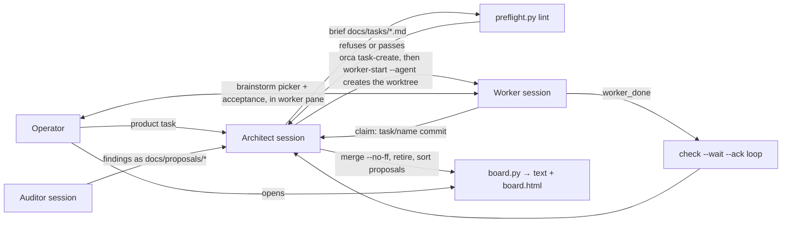

# feat: Project-Agnostic Orca Orchestration Harness

## Summary

Build the architect/worker/auditor development harness inside encar-ru: `/architect` and `/auditor` skills, a worker pipeline doc under 100 lines, a per-project config doc, and two thin Python-stdlib scripts (brief preflight, git-derived board). All delivery and lifecycle run on native Orca orchestration; a spike proves that path before anything is built on it.

---

## Problem Frame

rf-bot proved the working model but welded it to a game domain, Windows paths, and a homemade delivery layer that produced the operator's three recurring failures (unsubmitted prompts, unseen completions, torn messages). This plan rebuilds the model thin and generic in its first consumer, encar-ru. (see origin: docs/brainstorms/2026-08-08-orca-harness-requirements.md)

---

## Requirements

From the origin document: R1–R3 (roles as agnostic skills + per-project config), R4–R7 (native delivery, single ack-based ears, inbox-as-source, claim commit), R8–R11 (derived board, ~15-line briefs with preflight, <100-line worker read path, minimal gate set), R12–R13 (operator accepts product scenarios at the worktree before PR; product questions via picker in the worker's pane).

---

## Key Technical Decisions

- **Native Orca is the delivery layer** (R4–R6). Dispatch via `worker-start` with agent-first start; ears via `check --wait` + explicit `--ack`; message bodies from `inbox --json` (UTF-8 BOM → `utf-8-sig`); long content as files in the worker's worktree. rf-bot's two-step terminal choreography is not ported — it is where the three measured failures lived.
- **Python 3 stdlib only for scripts, 3.9-compatible.** Portable to any future consumer project regardless of its toolchain; no npm/pip dependencies to install in worktrees. Mirrors rf-bot's harness language, so its measured lessons translate directly. The machine's default `python3` is 3.9.6 — no `tomllib` — so the brief header is a flat `key = value` block (strings and string arrays only) parsed by ~30 hand-rolled lines, not TOML.
- **Scripts are small by contract.** Preflight and board together stay under ~400 lines total. rf-bot's 531 KB dispatch.py is the anti-goal; anything beyond lint/derive belongs in the skills as procedure, not code.
- **Skills read project specifics from `docs/harness/project.md`** (R3). The skills name the path convention; the file carries: what a product scenario means here, shared resources and ceilings, domain traps. Skills contain zero project references.
- **Board = one script, two outputs** (R8): terminal text and `docs/harness/board.html` for the operator. Derived from `git log main --merges` (landed), worktree state (in progress), and brief files (queued). Regenerated by the architect on each queue action; no git hooks day one (light core — hooks are a gate to add when staleness bites twice).
- **Brief header is a `+++`-fenced flat `key = value` block with the minimal field set:** `branch`, `worktree`, `size` + `size_why`, `owns`, `reads`, `accepts` (optional product scenario), `after` (optional deps). Dropped from rf-bot: `rank` (queue order = board order), `layer`, `needs_client`/`slot`/`character`/`pid` (game-specific), `frozen`, `model`/`effort`, `plan`, `ru`.
- **Claim commit stays** (R7): worker's first act is `git commit --allow-empty -m "claim: task/<name>"`; the architect treats a dispatch as delivered only when it exists.

---

## High-Level Technical Design

Lifecycle authority is Orca's (Run→Task→Dispatch, `worker_done` auto-completes); the harness adds only what Orca lacks: briefs, preflight, the landed-from-git board, acceptance convention, proposals channel.

---

## Implementation Units

### U1. Spike: prove native dispatch end to end

**Goal:** Verify the assumption the whole harness rests on — Orca's agent-first `worker-start` delivers and submits a prompt, `check --wait --ack` surfaces `worker_done`, and inbox round-trip carries a multi-paragraph body intact.

**Requirements:** R4, R5, R6, R7 (origin: Dependencies/Assumptions).

**Dependencies:** none.

**Files:** `docs/harness/spike-native-dispatch.md` (results record).

**Approach:** In the live Orca runtime: create a throwaway task + worktree, `worker-start --worktree ... --agent claude` with a trivial spec ordering a claim commit and a `worker_done`; watch for the claim commit (no manual enter anywhere); send a 2,000+ character message and have the worker echo its length back from `inbox --json`; ack the delivery. Record each measured outcome with the exact commands. If the runtime is unreachable at execution time, record that the spike is blocked and which AEs remain unverified — do not fake results.

**Test scenarios:**
- Covers AE1. Dispatch with agent-first start → claim commit appears with zero manual pane interaction.
- Covers AE2. `worker_done` sent while the coordinator is not waiting → surfaces on next `check --wait`, and after `--ack` does not replay.
- Covers AE3. 2,000+ char body → `inbox --json` returns it byte-complete (compare lengths).
- Failure path: `worker-start` refusing or prompt sitting unsubmitted → record verbatim; this flips the fallback decision (claim-commit wait + documented repair) from hypothetical to active.

**Verification:** spike record exists with measured outcomes for all three AEs, each marked proven/failed/blocked.

### U2. `/architect` skill

**Goal:** The architect's seat as a project-agnostic skill: session ritual, queue and board upkeep, brief writing, dispatch, acceptance-of-record, merge, retire, proposal verdicts.

**Requirements:** R1, R3, R5, R7, R12.

**Dependencies:** U1 (delivery procedure text depends on spike outcome).

**Files:** `.claude/skills/architect/SKILL.md`.

**Approach:** Written fresh in English, ~150–250 lines. Carries the generic halves of rf-bot's measured rules: the three-state worker messaging table (blocked/working/idle), inbox-as-source, letters-as-files, one ears loop armed once, `--no-ff` merges with `Merge task/<name>:` subjects, finished-branch processing order (stop → verify claims against code → merge → retire → sort proposals), "his acceptance is final", "size without size_why is ignored", the gate rule (mistake twice → gate, never a resolution to remember). Points to `docs/harness/project.md` for everything project-specific. Explicitly defers coordination-layer authority to `orca skills get orchestration`. The delivery procedure section is written from U1's measured commands (`task-create` → `worker-start`, which creates the worktree itself), never from assumptions.

**Test scenarios:** Test expectation: none — prose artifact; correctness is checked by U8's live run and review.

**Verification:** skill loads via `/architect`; contains no encar-ru or rf-bot domain references outside examples marked as such.

### U3. `/auditor` skill

**Goal:** The commissioned read-only pass as a generic skill.

**Requirements:** R2, R3.

**Dependencies:** none.

**Files:** `.claude/skills/auditor/SKILL.md`.

**Approach:** ~40–60 lines mirroring rf-bot's audit seat minus project refs: one commission per audit with the operator's question as scope, dated record in `docs/audit/`, findings exit only as `docs/proposals/` files, verdicts are the architect's, follow-up mode re-checks the previous record's numbers, "a finding class seen twice becomes a gate".

**Test scenarios:** Test expectation: none — prose artifact.

**Verification:** skill loads via `/auditor`; read-only contract stated unambiguously.

### U4. Worker pipeline doc + conventions

**Goal:** The worker's entire mandatory read path in one file under 100 lines, plus the brief and proposals conventions it references.

**Requirements:** R6, R7, R9, R10, R13.

**Dependencies:** U1.

**Files:** `docs/harness/pipeline.md`, `docs/tasks/README.md` (brief format + example), `docs/proposals/README.md` (one file per finding, machine-readable `> **Verdict:**` line).

**Approach:** pipeline.md carries only what no gate enforces: claim commit first, the ce-loop order sized by band (small: work→PR; normal: plan→work→review→PR; deep: full loop + compound), product questions to the operator via picker one at a time, `worker_done` is the last command, proposals for out-of-scope findings. No restating what hooks/gates refuse (rf-bot's "the spec says only what nothing else enforces").

**Test scenarios:** Test expectation: none — prose artifacts; the <100-line budget is checked in U5's preflight selftest (line-count assertion).

**Verification:** `wc -l docs/harness/pipeline.md` < 100.

### U5. Preflight + minimal boundary gate

**Goal:** The two shipped gates (R11): a brief lint that refuses malformed briefs before dispatch, and a thin hook protecting the main checkout from worker writes.

**Requirements:** R9, R11.

**Dependencies:** U4 (brief format).

**Files:** `harness/preflight.py`, `harness/test_preflight.py`, `.claude/hooks/boundary.py`, `.claude/settings.json` (hook wiring).

**Approach:** `preflight.py check <task>`: parses the `+++`-fenced flat header (hand-rolled, 3.9-compatible), refuses — missing/unknown fields, `size` without `size_why`, missing worktree or wrong branch, worktree behind `main`, `owns` colliding with another live brief's `owns`, malformed `accepts`. Exits non-zero with the reason printed (a refusal, not a warning). `boundary.py`: PreToolUse hook, v1 scoped to file tools only — blocks Write/Edit/NotebookEdit whose target resolves into the main checkout when the session cwd is a worktree; anchored on its own `__file__` path. Bash/git coverage (rf-bot needed triple resolution of `-C`/`--git-dir`/`cd` and a deny-list to close it) is explicitly a deferred gate, added when the first violation happens — v1 does not pretend to cover it. R11's third gate, the claim check, ships as architect procedure in U2, not as a script — a deliberate narrowing.

**Execution note:** test-first for the refusal matrix — each refusal is written as a failing test before the check exists.

**Test scenarios:**
- Happy path: valid brief with all required fields → exit 0, silent.
- `size = "small"` without `size_why` → refuse, message names both fields.
- Two briefs owning the same path, both with live worktrees → refuse the second.
- Worktree behind `main` → refuse with the ahead/behind counts.
- Missing `+++` header entirely → refuse ("no header, no dispatch").
- boundary: Edit targeting a file under the main checkout from a worker-worktree session → deny with reason; same edit inside the worktree → allow.

**Verification:** `python3 harness/test_preflight.py` green; a deliberate malformed brief is refused with a printed reason.

### U6. Board

**Goal:** The derived board (R8): who is queued, in progress, landed — from git and brief files, never hand-written; text to terminal, HTML for the operator.

**Requirements:** R8.

**Dependencies:** U4 (brief format).

**Files:** `harness/board.py`, `harness/test_board.py`.

**Approach:** Four states per task brief: no branch yet → QUEUED; branch exists, zero commits ahead, clean, unmerged → NOT STARTED; ahead>0 or dirty → IN PROGRESS; merge subject `Merge task/<name>` in `git log main --merges` → DONE. Prints text; `--html` writes `docs/harness/board.html` (gitignored). Cannot-look conditions exit non-zero saying where it looked (rf-bot's "no worktrees meant two opposite things" lesson). Orca live-status (cards) is read via `orca worktree ps` when available, shown as color only, never as the fact.

**Test scenarios:**
- Fixture repo with one merged `task/x` (proper merge subject) → DONE.
- Branch with commits ahead → IN PROGRESS; same branch clean, zero ahead, unmerged → NOT STARTED; brief with no branch → QUEUED.
- Fast-forwarded merge (no merge commit) → flagged as anomaly, not silently NOT STARTED.
- git unavailable / not a repo → non-zero exit, message says where it looked.

**Verification:** `python3 harness/test_board.py` green; board output on encar-ru shows this plan's own branch as IN PROGRESS.

### U7. encar-ru project config

**Goal:** The per-project half the skills read (R3): what a product scenario means in encar-ru, resources, traps.

**Requirements:** R3, R12.

**Dependencies:** U2 (path convention).

**Files:** `docs/harness/project.md`.

**Approach:** Short: product scenario = the operator watches the overlay work in a browser against a live encar.com page served from the worker's worktree build; no contended shared resources (unlike rf-bot's game clients — parallelism is bounded only by the architect's 3–5 branch ceiling); traps: MV3 bundles the core into the extension (version bump rule), `manifest.json` version must equal `VERSION` in `src/main.ts`.

**Test scenarios:** Test expectation: none — prose artifact.

**Verification:** `/architect` skill's project-config reference resolves to this file.

### U8. Live dry run (operator acceptance of the harness itself)

**Goal:** One real small encar-ru product task through the full loop: brief → preflight → dispatch → claim → work → operator watches the scenario → PR → merge → retire → board reflects it.

**Requirements:** all; this is AE1–AE4 executed for real.

**Dependencies:** U1–U7.

**Files:** none new (a brief in `docs/tasks/`, the run's own artifacts).

**Approach:** Requires the operator present and a product task chosen by him — deferred to a follow-up session after this PR merges; the plan's deliverable is the harness, the dry run is its acceptance. Record outcomes and file gaps as proposals.

**Test scenarios:** Test expectation: none — this unit IS the acceptance run.

**Verification:** operator's word after watching the scenario.

---

## Scope Boundaries

Carried from origin: no rf-bot retrofit; no wholesale port of rf-bot code; no plugin packaging (template extraction waits for a second consumer); no rank renumbering system; no multi-machine orchestration.

### Deferred to Follow-Up Work

- U8 live dry run (needs the operator and a real product task).
- Git-hook board regeneration — add when board staleness bites twice.
- Template extraction into a standalone repo — when a second project adopts the harness.

---

## Risks & Dependencies

- **Orca runtime availability at execution time.** The spike (U1) needs the Orca app running with orchestration enabled. If unreachable, U1 records blocked status and U2/U4 delivery text ships marked "assumes spike outcome: native path" — the fallback (claim-commit wait + repair procedure) is written into the architect skill either way.
- **Native dispatch may reproduce the enter-not-pressed failure.** Then the fallback becomes the primary path: claim-commit wait with one documented repair (re-send prompt once, then escalate to operator) — still no homemade terminal choreography.
- **Copy drift** (accepted at brainstorm): improvements made in future consumer projects flow back by hand.

---

## Sources & Research

- rf-bot: `.claude/skills/architect/SKILL.md`, `.claude/skills/audit/SKILL.md`, `docs/orchestration.md`, `harness/dispatch.py`, `harness/board.py` — the model and its measured traps.
- rf-bot audit records 2026-08-05/06 — the ceremony-tax findings this harness corrects (905-line read path, plugin-decided review width, unscaled architect overhead).
- `orca skills get orchestration` / `orca-cli` — native capability surface and documented gotchas (ack replay semantics, `worker_done` exactly-once, worktree ids, handle staleness).
