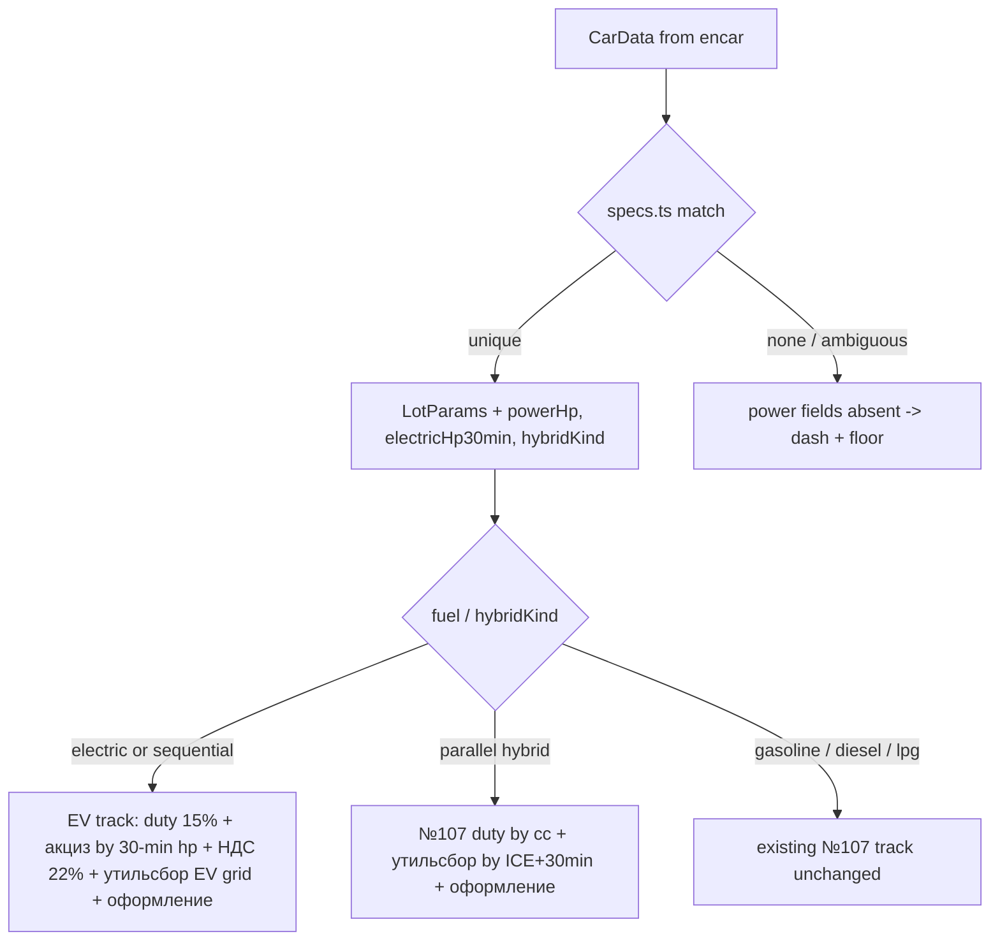

# feat: EV/hybrid customs tracks with drom.ru specs catalog

## Summary

Extend `src/calc/customs.ts` so EVs and sequential hybrids compute пошлина
15% + акциз (руб/л.с.) + НДС 22% instead of «по запросу», and parallel
hybrids get a real утильсбор from combined power (ICE + 30-min electric).
Power data comes from `site/specs-catalog.json`, scraped offline from
drom.ru by `scripts/build-catalog.mjs` and matched in-browser by
`src/calc/specs.ts`. The page seam is a single enrichment call in
`src/page/lot.ts`; the final wire into `src/page/main.ts` lands in a
follow-up dispatch after `task/importer-pricing`.

---

## Problem Frame

Encar is full of Korean hybrids and EVs, and the calculator is silent on
exactly those lots: EVs are «по запросу» (`src/calc/customs.ts:475`), hybrid
утильсбор dashes even with known power because the decree needs ICE + 30-min
electric combined. The power spike (`docs/harness/spike-power.md`) measured
that no public encar surface carries engine power for cars, so an external
specs source is the only path. The operator picked drom.ru and confirmed the
scope (see origin).

---

## Requirements

Carried from origin (same IDs). Traceability: U-IDs in parentheses.

**Tariff tracks (физлицо, личное пользование)**

- R1. An EV lot computes пошлина (ЕТТ 15%) + акциз (руб/л.с.) + НДС 22%
  instead of «по запросу» (U1, U2).
- R2. A sequential hybrid computes on the EV track; the catalog's hybrid-kind
  field decides sequential vs parallel (U2, U3).
- R3. A parallel hybrid keeps №107 duty by displacement; its утильсбор uses
  ICE + 30-min electric power combined (U2).
- R4. An EV's утильсбор uses the EV grid of ПП №1291 (ред. №1713) keyed by
  30-minute power (U1, U2).
- R5. Every new rate table carries `asOf`-style provenance (U1; comments in
  `customs.ts` until config migration — see KTD2).

**Specs catalog**

- R6. `site/specs-catalog.json` carries per Korean-market hybrid/EV
  modification: ICE hp, 30-min electric hp, hybrid kind, match keys (U3, U4).
- R7. Matching runs in the browser from CarData fields only; no runtime
  network calls to drom.ru (U3, U5).
- R8. No match or ambiguous match → power-dependent lines dash, total stays a
  floor «от N ₽» (U2, U3).

**Honesty**

- R9. The dash / floor / onRequest semantics of `src/calc/customs.ts` apply
  to all new lines unchanged (U1, U2).

---

## Key Technical Decisions

- **KTD1 — Route tracks inside the existing `customs_v1` expansion, no new
  formula id.** `computeAllIn` branches on `lot.fuel` + hybrid kind at the
  point where `isEv` short-circuits today (`customs.ts:475`). Keeps the
  "at most one customs item" validator (`src/config.ts:245`) and the config
  contract untouched.
- **KTD2 — New tariff tables are exported constants in `customs.ts`, not
  config, for now.** `site/config.json` / `src/config.default.ts` /
  `test/config-file.test.ts` are owned by the live `task/importer-pricing`
  (architect ruling, 2026-08-08). Constants carry the same provenance-comment
  style as `DEFAULT_CONFIG` and a header note that migration into
  `CustomsConfig` is a planned follow-up dispatch. The engine stays a bracket
  interpreter: computation functions take the tables as parameters;
  `computeAllIn` passes the constants.
- **KTD3 — `LotParams` grows `electricHp30min?: number` and
  `hybridKind?: "parallel" | "sequential"`;** `powerHp` keeps meaning ICE hp.
  EV power basis = 30-min power; sequential hybrid акциз/утильсбор basis =
  30-min power only; parallel hybrid утильсбор basis = `powerHp +
  electricHp30min` (акциз does not apply — №107 track).
- **KTD4 — Catalog is committed JSON, built offline.** drom.ru sends no CORS
  header and the product has no backend, so `scripts/build-catalog.mjs`
  (node ESM, follows `scripts/build-bookmarklet.mjs` conventions) snapshots
  drom catalog pages (windows-1251 → decode) into `site/specs-catalog.json`.
  CI never fetches drom; tests validate the committed file like
  `test/config-file.test.ts` validates `config.json`.
- **KTD5 — Ambiguity resolves to a dash, not a guess.** The matcher returns a
  spec only when candidates agree on the power figures (after filtering by
  model, production-month range, displacement, grade); disagreement or no
  match → `undefined` → existing partial/floor semantics (R8). A unique match
  is data, not an estimate — `estimated` stays false.
- **KTD6 — Page integration is one seam.** `src/page/lot.ts` exports a
  catalog loader (fetch + validate + graceful undefined, mirroring
  `loadConfig`'s shape at `src/config.ts:261`) and an enrichment step for
  `toLotDetails`. `src/page/main.ts` is owned by importer-pricing; the 1-line
  wire happens there in a follow-up dispatch. Until then EV/hybrid lines
  dash on the live page — expected intermediate state.

---

## High-Level Technical Design

Track selection happens once inside the `customs_v1` expansion; every branch
reuses the existing line-building, precision, and note machinery.

---

## Implementation Units

### U1. Pin tariff tables from primary sources and encode them

- **Goal:** every new rate is a constant in `customs.ts` with a legal-source
  comment, verified against document texts, not blog re-transcriptions.
- **Requirements:** R1, R4, R5, R9.
- **Dependencies:** none.
- **Files:** `src/calc/customs.ts`, `test/calc.test.ts`.
- **Approach:** pull annexes from publication.pravo.gov.ru: ПП №1291 в ред.
  №1713 (+ ПП №1255 indexation) for the EV/hybrid утильсбор grid and the
  льгота (3 400 / 5 200 ₽, threshold 30-min power ≤80 л.с.); ФЗ №425-ФЗ for
  акциз brackets 2026 and НДС 22%; Решение ЕЭК №81/№111 for BEV/REEV codes
  and the 15% duty with no RU privilege. Resolve the klerk.ru claim that the
  льгота died in April 2026 — whichever way it lands, encode what the decree
  text says and date it. Table shapes follow `isBracketArray` conventions
  (ascending, inclusive max, open-ended last).
- **Test scenarios:** pin each table's boundary values (90/150/200/300/400/500
  л.с. акциз edges; 80 л.с. льгота edge; EV grid bracket edges) against
  hand-computed expectations with source comments, mirroring
  `test/calc.test.ts:1-16` conventions.
- **Verification:** the льгота conflict is resolved with a cited primary
  source; tsc and vitest green.

### U2. Track routing and new cost lines in the engine

- **Goal:** EV and sequential hybrids produce duty/акциз/НДС/утильсбор/
  оформление lines; parallel hybrids get combined-power утильсбор; honesty
  semantics intact.
- **Requirements:** R1, R2, R3, R4, R8, R9.
- **Dependencies:** U1.
- **Files:** `src/calc/customs.ts`, `test/calc.test.ts`.
- **Approach:** extend `LotParams` per KTD3; replace the `isEv` short-circuit
  with track routing per KTD1/HTD. New line ids (`excise`, `vat`) join
  `duty`/`recycling`/`clearance` with Russian labels as local constants
  (labels migrate to config later with KTD2). НДС base = customs value +
  duty + акциз. Missing 30-min power on the EV/sequential track dashes акциз,
  утильсбор and НДС-on-акциз honestly: compute НДС on the known base parts
  only if that stays a provable floor, otherwise dash the line — keep the
  floor provable, never overstate. Hybrid with unknown kind → power lines
  dash (partial), not onRequest.
- **Execution note:** rewrite the pinned EV-onRequest tests
  (`test/calc.test.ts:746-793`) to the new behavior first — they document the
  old contract and must not be deleted silently.
- **Test scenarios:** EV with known 30-min power (full table, hand-computed);
  EV without power (duty+НДС floor, акциз/утильсбор dash); sequential hybrid
  = EV track; parallel hybrid with both powers (утильсбор from sum, льгота
  edge at 80 л.с. combined); parallel hybrid missing one power (dash);
  hybrid unknown kind (dash, partial); gasoline lot unchanged (regression);
  malformed power (negative/NaN → onRequest).
- **Verification:** all AE-shaped origin examples pass; existing non-EV tests
  untouched and green.

### U3. Specs catalog schema and matcher

- **Goal:** `src/calc/specs.ts` types the catalog and matches a CarData to a
  modification's power figures.
- **Requirements:** R6, R7, R8.
- **Dependencies:** none (parallel with U1/U2; U2 consumes its output shape).
- **Files:** `src/calc/specs.ts`, `test/specs.test.ts`.
- **Approach:** catalog schema keyed for matching from CarData only:
  normalized manufacturer + model tokens, production-month range
  (`yearMonth` falls inside), displacement (exact cc for hybrids, absent for
  EV), grade/trim tokens from `title`, per-modification `{iceHp,
  electricHp30min, hybridKind, fuel}`. Matcher: filter candidates stepwise,
  then per KTD5 return the spec only when survivors agree on the numbers.
  Include a validator (`isValidCatalog`) reusing the defensive style of
  `src/config.ts` so a corrupt fetched file degrades to "no catalog".
- **Test scenarios:** unique match by model+cc+year; two trims same power →
  match; two trims different power → undefined; yearMonth outside production
  range → undefined; EV matched without cc; Korean/English title variants;
  corrupt catalog JSON → validator rejects.
- **Verification:** matcher is pure and network-free; vitest green.

### U4. Offline collector and the committed catalog

- **Goal:** `scripts/build-catalog.mjs` regenerates `site/specs-catalog.json`
  from drom.ru; the shipped file covers the initial model list.
- **Requirements:** R6.
- **Dependencies:** U3 (schema).
- **Files:** `scripts/build-catalog.mjs`, `site/specs-catalog.json`,
  `test/specs.test.ts` (shipped-file validation).
- **Approach:** node ESM script, no deps (repo convention): fetch
  `drom.ru/catalog/<brand>/<model>/` generation pages (Korean-market
  generations), then modification pages; decode windows-1251; parse the spec
  rows measured 2026-08-08 («Максимальная мощность…», «Электродвигатель:
  30-минутная мощность, л.с.», «Вид гибрида», «Объем двигателя, куб.см»,
  production months). Model list (initial): Hyundai Sonata, Grandeur, Kona,
  Santa Fe, Tucson, Ioniq 5/6; Kia K5, K8, Niro, Sorento, Sportage, EV6,
  EV9; Genesis G80/GV70/GV80 electrified. Rate-limit politely; the script is
  run by hand, never in CI. Emit deterministic sorted JSON for reviewable
  diffs.
- **Test scenarios:** `test/specs.test.ts` validates the committed file
  against `isValidCatalog`, checks it is non-empty, sorted, and that a few
  known modifications (Sonata DN8 HEV 152+20; Ioniq 5 58kWh 76 hp 30-min)
  are present with the measured figures.
- **Verification:** re-running the script reproduces the committed file
  modulo drom data changes; the file ships via the existing Pages deploy
  (whole `site/` uploaded).

### U5. Page enrichment seam in lot.ts

- **Goal:** the page can load the catalog and enrich lot details, exposed as
  functions `main.ts` will call with 1-3 lines in the follow-up wiring
  dispatch.
- **Requirements:** R7, R8; origin flow F1.
- **Dependencies:** U2, U3.
- **Files:** `src/page/lot.ts`, `test/page-lot.test.ts`.
- **Approach:** export `loadSpecsCatalog(url)` (fetch + timeout + validate +
  `undefined` on any failure, mirroring `loadConfig` at `src/config.ts:261`)
  and extend `toLotDetails(car, catalog?)` to fill `powerHp`,
  `electricHp30min`, `hybridKind` from the U3 matcher when a catalog is
  present. No behavior change when catalog is absent.
- **Test scenarios:** enrichment fills fields on a fixture CarData with a
  fixture catalog; absent catalog → identical output to today (regression);
  fetch failure/timeout/corrupt JSON → `undefined` catalog, no throw
  (jsdom + stubbed fetch, no network per `src/main.ts:216` guard
  convention).
- **Verification:** `toLotDetails` stays backward-compatible for existing
  callers; vitest green.

---

## Scope Boundaries

- ЮЛ/commercial track, manual power inputs, live drom lookups — out (origin).
- **Deferred to follow-up dispatches:** migrating the U1 tables into
  `CustomsConfig` + `site/config.json` (blocked by `task/importer-pricing`
  ownership); the 1-line wire in `src/page/main.ts`; extending catalog
  coverage beyond the initial model list.

---

## Risks & Dependencies

- **Утильсбор льгота conflict (high impact):** one source claims the
  3 400/5 200 ₽ льгота was replaced by ~150k/383k minimums in April 2026.
  U1 resolves it from the decree text before any totals ship. Totals for
  ≤80 л.с. hybrids/EVs swing by hundreds of thousands of rubles on this.
- **Grid values single-sourced:** the full EV/power grids came from one
  secondary source; U1 re-derives them from the annex tables.
- **tks.ru methodology opacity:** the results page is reCAPTCHA-gated; the
  acceptance comparison (operator, 2-3 live lots) is the ground truth, and
  on-screen notes must explain any legitimate difference (e.g. НДС 22% vs a
  stale tks table).
- **drom.ru format drift:** the collector depends on measured 2026-08-08 row
  labels; committed JSON isolates the product from drift until the next
  manual re-run.
- **Parallel task `importer-pricing`** rewrites cost items and owns config +
  `main.ts`; conflicts are avoided by KTD2/KTD6, and the acceptance demo
  runs off this worktree with a local, uncommitted wire in `main.ts`.

---

## Documentation / Operational Notes

- Acceptance (brief `accepts`): before the PR, the operator compares quotes
  for 2-3 real lots (petrol, hybrid, EV) against tks.ru at this worktree —
  demoed with a local uncommitted `main.ts` wire.
- The report to the architect must state the config-migration table (KTD2)
  and the `main.ts` wire as ready follow-up dispatches.
